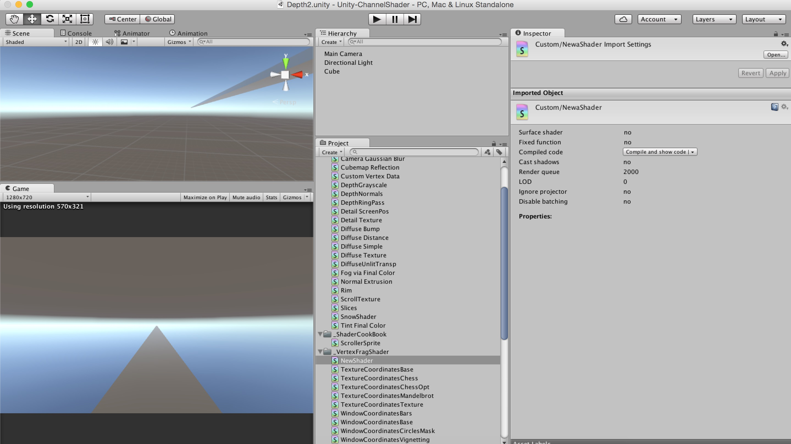
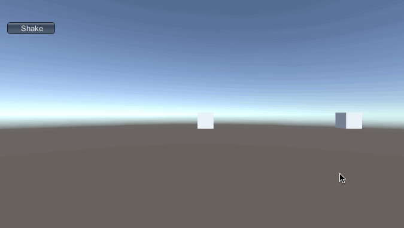
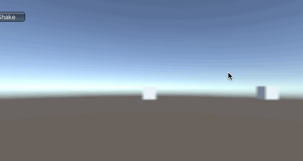

##Unity-Channel-Shader

About Unity-Channel-Surface

[Doc](http://docs.unity3d.com/Manual/SL-SurfaceShaderExamples.html)

 

##Mirror with bump

 

##Shake with Fuzzy

 

##Animator with effect

 

###Note: Just a demo.